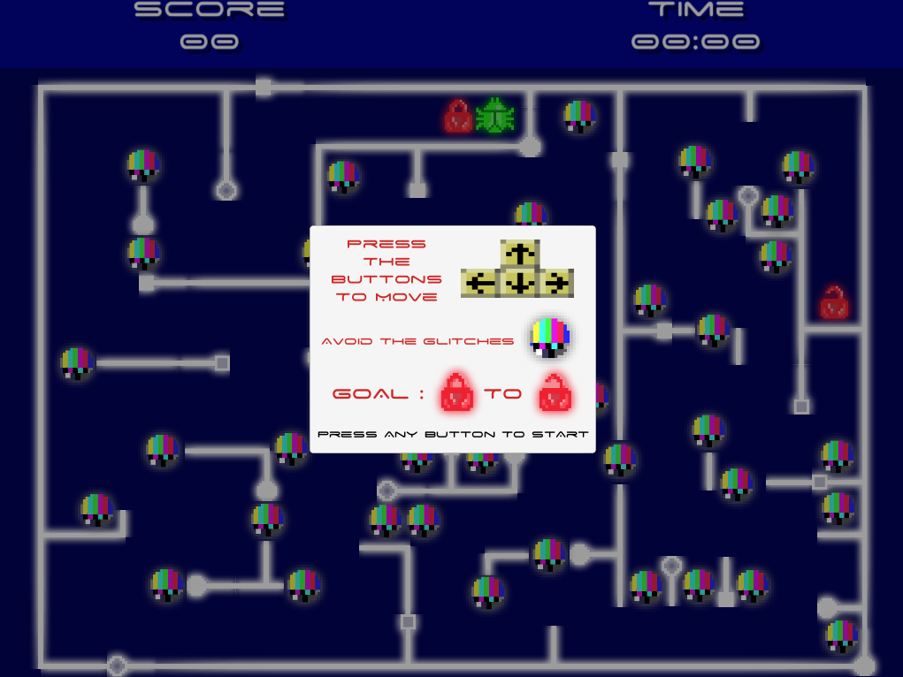
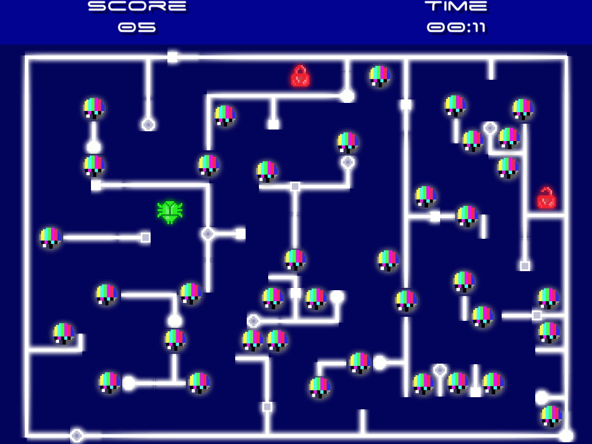
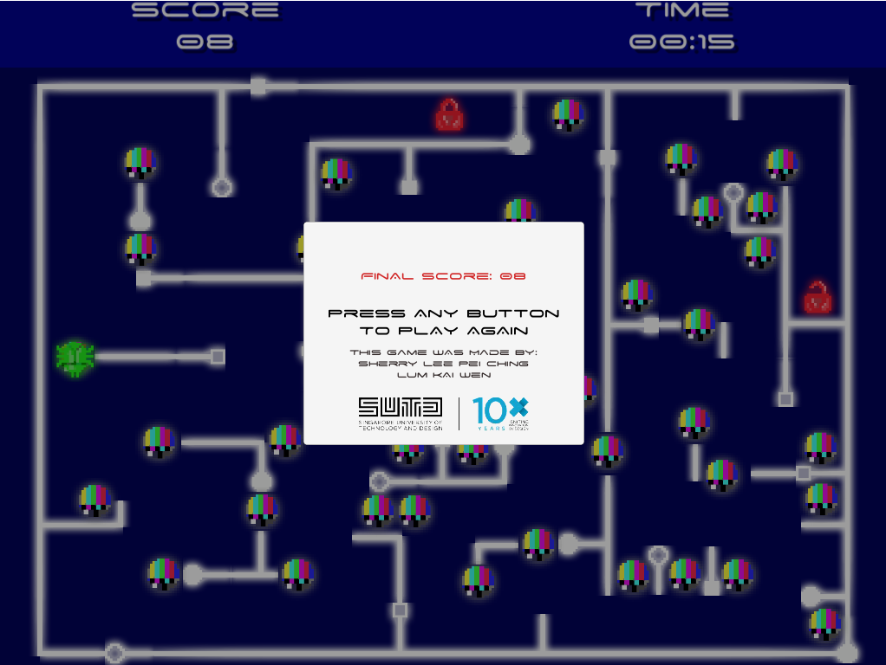

# BUG
## About
Bluetooth Ultrasimple Gamepad (BUG) is a simple maze game modelled after Labyrinth. The idea of this project is to promote a collaborative gaming experience that requires 4 players for a traditionally single-player game. We designed and developed 4 controllers such that each player only controls 1 direction the bug can move in. Hence, requiring them to communicate in order to safely navigate pass the Glitches.

BUG was developed as an Undergraduate Research Opportunities Programme (UROP) project. Received an official UROP Certificate of Completion.

Group members:
* Sherry Lee Pei Ching (game)
* Lum Kai Wen (controllers)

Developed with:
* C#
* Unity, Adobe Photoshop

## Features
* Scoring system that increases each time you pass a Glitch safely
* Timer
* Customised UI to fit theme of software bug

## Screenshots

  

  

  

## Release
You can download and play the latest, working version (with minor bugs) under **Releases**.

Compatible with Windows.

## Known Bugs and Issues
* Playing the game at resolutions higher than 1152 x 864 results in the disappearance of some UI.
* Player can sometimes move through walls.

